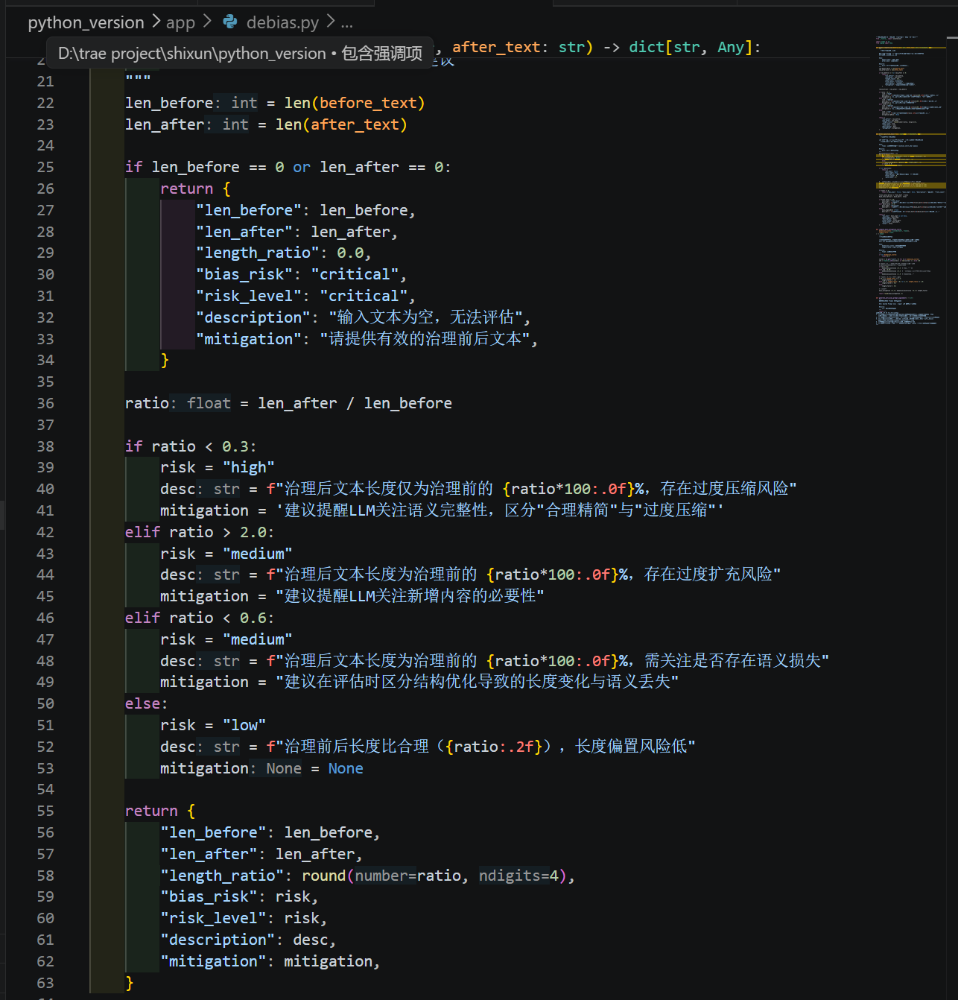
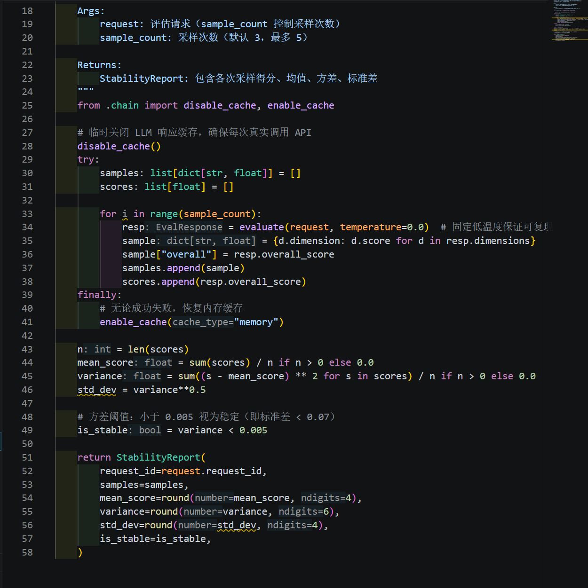
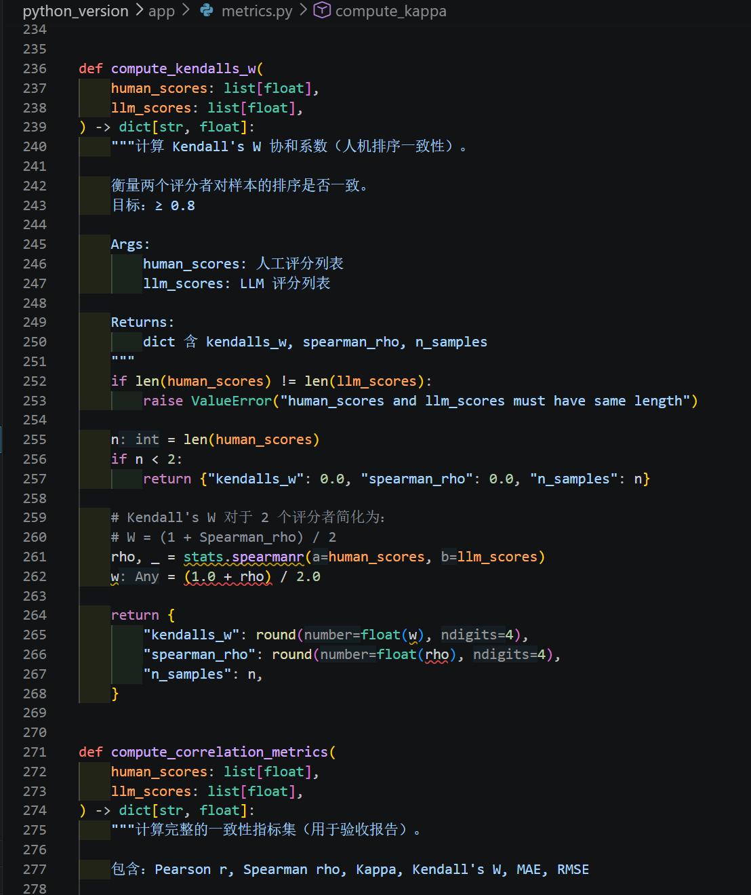

# 大模型内容安全与质量评估智能体 · 研发日报

---

|          |                                          |
|----------|------------------------------------------|
| **日期** | 2026年6月30日（周一）                     |
| **课题** | 内容保真度与治理质量评估智能体（LLM-as-Judge） |
| **阶段** | Phase 2 — 抗偏置与稳定性保障 + Phase 3 — 瑕疵检出与锚点定位 |
| **日报编号** | Day 3 / 10                           |
| **组长** | 李首澎                                   |
| **组员** | 阿思晗、由靖喆                            |

---

## 一、组员进度汇报

### 1.1 组员：阿思晗

#### 今日任务：偏置检测模块实现 + 评估 Profile 系统开发

今日围绕偏置检测和评估 Profile 系统展开辅助开发工作。

上午在 `app/debias.py` 中实现了四项偏置检测功能：长度偏置检测（P2-1，计算治理前后文本长度比，标记 High/Medium/Low 风险等级）、位置偏置检测（P2-2，分析瑕疵分布是否集中在前/后半部分，检测 front_bias/back_bias）、偏置缓解得分计算（P2-3，维度标准差 × 0.5 + 长度因子 × 0.5）和抗偏置 Prompt 补充指令生成（P2-4，长度无关/位置无关/格式无关/领域无关）。

下午完成了评估 Profile 系统（`app/profiles.py`）的开发，实现了 3 个 Profile：general（通用评估）、government_notice_strict（政府公告严格模式，对日期/期限/义务等关键事实提高敏感度）和 legal_strict（法律文书严格模式，对条款引用/权利义务表述提高准确性要求）。每个 Profile 定义了 critical_fact_types 和 penalty_policy，评估时动态调整 Prompt 规则和扣分力度。同时在 `app/metrics.py` 中实现了 BERTScore 文本相似度指标，基于 BERT 词向量计算语义层面的匹配度。

| 任务 | 完成状态 |
|------|----------|
| P2-1 长度偏置检测（`app/debias.py`） | ✅ 已完成 |
| P2-2 位置偏置检测（`app/debias.py`） | ✅ 已完成 |
| P2-3 偏置缓解得分计算（`app/debias.py`） | ✅ 已完成 |
| P2-4 抗偏置 Prompt 补充指令（`app/debias.py`） | ✅ 已完成 |
| 评估 Profile 系统（3 个 Profile） | ✅ 已完成 |
| BERTScore 文本相似度指标 | ✅ 已完成 |

**计划工时：4h　　实际工时：约 4h　　偏差：持平**

---

### 1.2 组员：由靖喆

#### 今日任务：偏置检测前端展示 + 指标可视化 + 校准脚本联调

今日配合后端开发，完成前端展示和联调工作。

上午在 Streamlit 界面和 `static/index.html` 中增加了偏置分析结果的展示区域，以卡片形式展示长度偏置风险等级、位置偏置说明和偏置缓解得分。下午在前端增加了 F1、Precision、Recall 和 anchor accuracy 的展示区域，并对 `run_calibration.py` 校准脚本进行了联调。

| 任务 | 完成状态 |
|------|----------|
| 偏置分析结果前端展示集成 | ✅ 已完成 |
| 瑕疵检出指标与锚点准确率前端展示 | ✅ 已完成 |
| `run_calibration.py` 校准脚本联调 | ✅ 已完成 |

**计划工时：2h　　实际工时：约 2h　　偏差：持平**

---

## 二、组长汇总

### 2.1 今日整体进度说明

根据研发计划书安排，Day 3 对应 Phase 2（抗偏置与稳定性保障）和 Phase 3（评估指标与校准）的核心开发任务。今日完成了 Phase 2 全部 6 项任务（P2-1 至 P2-6）和 Phase 3 的前 3 项任务（P3-1 至 P3-3），系统当前已具备完整的偏置检测能力、稳定性验证机制、可复现性令牌、瑕疵检出指标和锚点定位准确率计算能力。

### 2.2 组员任务完成情况汇总

| 姓名 | 今日任务 | 完成状态 | 备注 |
|------|----------|----------|------|
| 李首澎（组长） | P2-5 稳定性 + P2-6 可复现令牌 + P3-1/2/3 指标与校准 + Profile 系统设计 | ✅ 全部完成 | 核心技术工作 |
| 阿思晗 | P2-1/2/3/4 偏置检测实现 + BERTScore | ✅ 全部完成 | 辅助模块开发 |
| 由靖喆 | 前端展示集成 + 校准脚本联调 | ✅ 全部完成 | 按时完成 |

### 2.3 组长今日工作内容

今日作为组长和技术负责人，承担了 Phase 2 和 Phase 3 的核心技术开发工作：

1. **P2-5 评分稳定性模块**：在 `app/stability.py` 中实现了多次采样分析逻辑，对同一输入执行 n≥3 次评估（temperature=0.0），计算均值、方差和标准差，判定标准为方差 < 0.005。
2. **P2-6 可复现性令牌**：在 `app/engine.py` 中实现了基于 SHA256 哈希的可复现令牌生成机制，输入文本 + 模型参数 + Prompt 版本的哈希确保固定策略下结果一致。
3. **P3-1 瑕疵检出指标**：在 `app/metrics.py` 中实现了 Precision/Recall/F1 计算，将 LLM 输出的瑕疵列表与 GT 进行比对。
4. **P3-2 锚点定位准确率**：实现了字符容差 ≤ 10 字符的锚点匹配算法。
5. **P3-3 一致性校准**：在 `app/calibration.py` 中实现了 Pearson r / Spearman ρ / MAE / RMSE / 一致率五项校准指标。
6. **评估 Profile 系统设计**：设计了 Profile 注册架构和共享模型基础，确定了 Profile 感知的 Prompt 构建方案。

**计划工时：6h　　实际工时：约 6h　　偏差：持平**

---

## 三、今日研发过程记录

### 3.1 Phase 2 — 抗偏置与稳定性保障

#### P2-1 长度偏置检测

在 `app/debias.py` 中实现了 `detect_length_bias()` 函数，计算治理前后文本的字符数比值，当比值超过 1.5 或低于 0.67 时标记为 High 风险，1.2-1.5 或 0.67-0.83 为 Medium，其余为 Low。风险等级和说明信息输出到综合报告中。

#### P2-2 位置偏置检测

实现了 `detect_position_bias()` 函数，将瑕疵位置按文本前后 50% 分界，统计前半部分瑕疵占比。当前半部分占比 > 70% 时判定为 front_bias，后半部分占比 > 70% 时判定为 back_bias，否则为 balanced。

#### P2-3 偏置缓解得分

偏置缓解得分 = 维度分数标准差 × 0.5 + 长度因子 × 0.5。维度分数标准差越大说明各维度评分越分散（可能受偏置影响），长度因子反映文本长度差异带来的偏置风险。

#### P2-4 抗偏置 Prompt 补充指令

在 `app/debias.py` 中实现了 `get_debias_instructions()` 函数，返回四类抗偏置指令文本，在 `app/prompts.py` 构建 System Prompt 时自动追加：
- 长度无关：评分不应因文本长短而产生系统性偏差
- 位置无关：瑕疵检出不应受其在文本中位置的影响
- 格式无关：纯格式调整不应被视为语义变更
- 领域无关：评分标准应跨领域保持一致

#### P2-5 评分稳定性验证

在 `app/stability.py` 中实现了 `run_stability()` 函数，对同一输入执行 n 次评估（默认 n=3），计算评分的均值、方差和标准差，方差 < 0.005 判定为稳定。

#### P2-6 可复现性令牌

在 `app/engine.py` 中，对输入文本 + 模型参数 + Prompt 版本进行 SHA256 哈希，生成 reproducibility_token。相同输入在固定策略下始终生成相同令牌，支持结果复现和历史查询。

### 3.2 Phase 3 — 评估指标与校准（P3-1 至 P3-3）

#### P3-1 瑕疵检出指标

在 `app/metrics.py` 中实现了 `compute_flaw_metrics()` 函数：
- **Precision**：LLM 检出的瑕疵中，有多少与 GT 匹配
- **Recall**：GT 中的瑕疵中，有多少被 LLM 检出
- **F1**：Precision 和 Recall 的调和平均

匹配逻辑基于瑕疵类型（type）和位置（location）的联合判定。

#### P3-2 锚点定位准确率

实现了 `compute_anchor_accuracy()` 函数，将 LLM 输出的瑕疵位置与 GT 标注进行字符级比对，字符容差 ≤ 10 字符。在容差范围内的匹配计为定位准确，最终输出准确率百分比。

#### P3-3 一致性校准

在 `app/calibration.py` 中实现了 `calibrate()` 函数，计算五项校准指标：
- Pearson r（线性相关系数）
- Spearman ρ（秩相关系数）
- MAE（平均绝对误差）
- RMSE（均方根误差）
- 一致率（误差 ≤ 0.1 的样本比例）

### 3.3 额外功能 — 评估 Profile 系统

在完成计划任务的基础上，同步搭建了评估 Profile 系统（`app/profiles.py`），旨在支持不同文本类型的差异化评估策略。实现了三个 Profile：

1. **general**：通用评估 Profile，适用于一般性文本治理场景，评分规则为默认配置；
2. **government_notice_strict**：政府公告严格 Profile，针对政府公告类文本提高对日期、期限、义务等关键事实的敏感度，对这类信息的误改施加更严厉的扣分；
3. **legal_strict**：法律文书严格 Profile，针对法律文本提高对条款引用、权利义务表述的准确性要求。

每个 Profile 定义了 critical_fact_types（关键事实类型列表）和 penalty_policy（处罚策略），在评估时根据当前 Profile 动态调整 Prompt 中的评分规则和扣分力度。Profile 系统与 `app/prompts.py` 和 `app/engine.py` 已完成对接。

### 3.4 额外功能 — BERTScore 指标

在 `app/metrics.py` 中额外实现了 BERTScore 文本相似度指标。与 ROUGE-L 基于字符匹配不同，BERTScore 基于 BERT 词向量计算语义层面的相似度，能够捕捉同义替换和语序变化等更细粒度的文本差异。该指标用于评估 LLM 生成的瑕疵描述与人工标注之间的语义匹配程度，作为 ROUGE-L 的补充。

---

## 四、关键产出

| 产出内容 | 对应计划任务 | 说明 |
|----------|-------------|------|
| `app/debias.py` 偏置检测模块 | P2-1 / P2-2 / P2-3 / P2-4 | 长度偏置 + 位置偏置 + 缓解得分 + 抗偏置指令 |
| `app/stability.py` 稳定性验证 | P2-5 | 多次采样 n≥3，方差 < 0.005 |
| `app/engine.py` 可复现性令牌 | P2-6 | SHA256 哈希，固定策略下结果一致 |
| `app/metrics.py` 瑕疵检出指标 | P3-1 | Precision / Recall / F1 |
| `app/metrics.py` 锚点定位准确率 | P3-2 | 字符容差 ≤ 10 字符匹配 |
| `app/calibration.py` 一致性校准 | P3-3 | Pearson / Spearman / MAE / RMSE / 一致率 |
| `run_calibration.py` 校准脚本联调 | P3-3 | 校准流程端到端验证 |
| 前端偏置分析展示 | — | 风险等级 + 说明信息卡片 |
| 前端指标展示 | — | F1 / Precision / Recall / anchor accuracy |
| `app/profiles.py` 评估 Profile 系统 | 额外功能 | 3 个 Profile：通用 / 政府公告 / 法律文书 |
| `app/metrics.py` BERTScore 指标 | 额外功能 | 基于 BERT 词向量的语义相似度 |

---

## 五、当前进度评估

### 5.1 里程碑进度看板

| 里程碑 | 完成标志 | 目标日 | 当前状态 | 风险等级 |
|--------|----------|--------|----------|----------|
| M1: 校准达标 | Pearson r ≥ 0.8 | Day 2 | ✅ 已完成前置调优 | 🟢 低 |
| M2: 指标全部达标 | F1 / 锚点 / 偏置 / 稳定性 通过 | Day 5 | ⏳ Phase 2 全部完成，Phase 3 进展顺利 | 🟢 低 |
| M3: 集成测试通过 | 全流程无 Bug | Day 6 | 🔲 未开始 | 🟢 低 |
| M4: 演示材料完备 | PPT + 脚本 + Demo 就绪 | Day 9 | 🔲 未开始 | 🟢 低 |
| M5: 最终提交 | 全部材料打包提交 | Day 10 | 🔲 未开始 | 🟢 低 |

### 5.2 总体进度状态

> **当前状态：正常推进，Phase 2 已全部完成，Phase 3 完成前 3 项。**
>
> Day 3 完成了偏置检测（P2-1/2/3）、抗偏置指令（P2-4）、稳定性验证（P2-5）、可复现性令牌（P2-6）以及瑕疵检出指标（P3-1）、锚点定位准确率（P3-2）、一致性校准（P3-3）。剩余 P3-4（数据集扩充）和 P3-5（Prompt 调优迭代）将在后续推进。

---

## 六、后续安排

后续工作将继续推进 Phase 3 的剩余任务（评估数据集扩充、Prompt 调优迭代），并进入 Phase 6 端到端集成测试阶段，重点检查从 API 调用到结果渲染的完整链路，补足边界测试和异常测试支撑。

---

## 七、总结

今天按照研发计划书 Phase 2 和 Phase 3 的任务分解，完成了偏置检测模块的全部四项功能、稳定性验证和可复现性令牌的实现，以及瑕疵检出指标、锚点定位准确率和一致性校准三项核心指标的开发。系统在"抗偏置能力"和"量化验证能力"两个方面实现了关键提升。全组成员任务完成情况正常，进度与计划保持一致。
